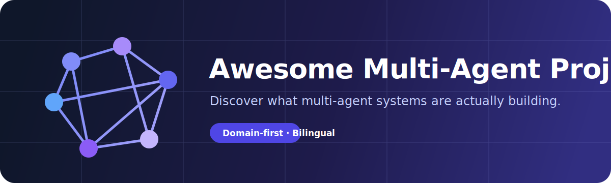

# Awesome Multi-Agent Projects

> 面向全球开源社区、按实际应用领域整理的多智能体系统、框架、产品与真实应用双语入口。

**从实际应用领域出发，发现多智能体正在真正构建什么。**

[English](README.md) | [简体中文](README.zh-CN.md)

[网站部署待授权](docs/DEPLOYMENT.md) · [提交项目](https://github.com/xxiaoxiong/awesome-multi-agent-projects/issues/new?template=project-submission.yml)

     

这是一个按实际应用领域组织、以质量和清晰边界为优先的开源多智能体项目目录。结构化数据同时生成中英文 README 与静态网站，避免多份清单漂移。

## 最近收录

- [CrewAI](https://github.com/crewAIInc/crewAI) — 通过明确的角色、任务、流程、工具和职责委派来构建协作式智能体团队的框架。
  `framework` `Python` `Self-hosted`

- [AutoGen](https://github.com/microsoft/autogen) — 微软推出的对话式智能体框架，支持多个智能体组队、交换消息、使用工具并协同完成复杂工作流。
  `framework` `Python` `Self-hosted`

- [CAMEL](https://github.com/camel-ai/camel) — 面向通信式智能体、角色扮演社会、任务拆解和规模化多智能体实验的研究型框架。
  `framework` `Python` `Self-hosted`

- [AgentScope](https://github.com/agentscope-ai/agentscope) — 用于构建、运行和评估消息驱动型多智能体应用的开发平台，支持清晰的角色划分。
  `framework` `Python` `Self-hosted`

- [AgentVerse](https://github.com/OpenBMB/AgentVerse) — 用于在任务求解团队和仿真环境中部署多个大模型智能体，并配置协作结构的框架。
  `framework` `Python` `Self-hosted`

- [Langroid](https://github.com/langroid/langroid) — 将大模型应用组织为可通信智能体的轻量框架，支持工具、任务和显式消息传递。
  `framework` `Python` `Self-hosted`

- [Microsoft Agent Framework](https://github.com/microsoft/agent-framework) — 用于跨模型提供商组合智能体、工作流、交接和团队模式的开源 SDK 与运行时。
  `framework` `Python` `Self-hosted`

- [OpenAI Agents SDK for Python](https://github.com/openai/openai-agents-python) — 面向智能体应用的 Python SDK，支持交接、智能体工具化、护栏、追踪和多智能体编排模式。
  `framework` `Python` `Self-hosted`

## 按领域探索

**框架与编排** · **通信与协同** · **基础设施与开发工具** · **评测与基准** · **可观测性、安全与治理** · **编程与软件工程** · **研究与科学** · **金融与交易** · **数据与分析** · **企业与生产力** · **浏览器与计算机操作** · **网络安全** · **医疗与生命科学** · **教育与学习** · **机器人与具身智能** · **仿真、社会系统与游戏** · **营销、媒体与内容** · **法律与合规** · **客户服务与销售** · **通用智能体产品**

<!-- AUTO-GENERATED:PROJECTS:START -->

## 应用领域

### 编程与软件工程

- [MetaGPT](https://github.com/FoundationAgents/MetaGPT) — 模拟软件公司的多智能体项目，把产品、架构、开发和审查职责分配给不同协作智能体。
  `application` `Python` `Self-hosted`

- [ChatDev](https://github.com/OpenBMB/ChatDev) — 虚拟软件公司式多智能体应用，专业角色通过结构化阶段沟通并共同产出软件。
  `application` `Python` `Self-hosted`

- [Oh My Claude Code](https://github.com/Yeachan-Heo/oh-my-claudecode) — 面向 Claude Code 的编排层，通过专业智能体、任务路由和并行执行协同完成软件工作。
  `application` `TypeScript` `Self-hosted`

- [Gas Town](https://github.com/gastownhall/gastown) — 用于在持久化软件项目中协调多个编程智能体的工作区与任务编排系统。
  `application` `Go` `Self-hosted`

- [ClawTeam](https://github.com/HKUDS/ClawTeam) — 围绕共享软件任务组织自治智能体，并开展团队式协同执行的编程系统。
  `application` `Python` `Self-hosted` `experimental`

- [Multi-Agent Coding System](https://github.com/Danau5tin/multi-agent-coding-system) — 把规划、实现、审查和测试职责拆给多个专业智能体协作完成的编程工作流。
  `application` `Python` `Self-hosted`

- [Claude Flow](https://github.com/ruvnet/claude-flow) — 用于协调 Claude 智能体群体、共享记忆、任务图和编程工作流的编排层。
  `application` `TypeScript` `Self-hosted`

- [Claude Code Agents](https://github.com/wshobson/agents) — 面向专业 Claude Code 智能体的集合与编排方案，支持在工程工作流中协作。
  `application` `Python` `Self-hosted`

### 研究与科学

- [Robin](https://github.com/Future-House/robin) — 协调专业智能体完成文献检索、分析和研究综合的开放科学研究系统。
  `application` `Python` `Self-hosted`

- [DeerFlow](https://github.com/bytedance/deer-flow) — 社区驱动的深度研究框架，协调规划、检索、推理和报告生成智能体完成研究任务。
  `application` `Python` `Self-hosted`

- [DeepResearchAgent](https://github.com/SkyworkAI/DeepResearchAgent) — 通过拆解调研任务并协调浏览、推理和综合组件完成深度研究的智能体系统。
  `application` `Python` `Self-hosted`

- [Denario](https://github.com/AstroPilot-AI/Denario) — 用于科研创意生成、文献综述、实验规划和论文撰写的多智能体科学平台。
  `application` `Python` `Self-hosted`

- [Paper2Agent](https://github.com/jmiao24/Paper2Agent) — 把研究论文转化为可交互智能体团队，使其能够使用论文方法与工具的系统。
  `application` `Python` `Self-hosted`

- [CMBAgent](https://github.com/CMBAgents/cmbagent) — 面向宇宙学研究的多智能体系统，协同完成科学推理、编码、检索和验证。
  `application` `Python` `Self-hosted`

- [WarAgent](https://github.com/agiresearch/WarAgent) — 使用多个大模型智能体模拟历史决策和国际冲突动态的研究实现。
  `application` `Python` `Self-hosted`

### 金融与交易

- [TradingAgents](https://github.com/TauricResearch/TradingAgents) — 由分析、研究、交易、风控和组合管理智能体协作辩论投资决策的交易研究框架。
  `application` `Python` `Self-hosted`

- [FinRobot](https://github.com/AI4Finance-Foundation/FinRobot) — 开放金融智能体平台，通过专业角色完成市场研究、文档分析、预测和报告。
  `application` `Python` `Self-hosted`

- [TradingAgents-CN](https://github.com/hsliuping/TradingAgents-CN) — 针对中国市场适配的 TradingAgents，实现本地化数据源和协作式投资研究角色。
  `application` `Python` `Self-hosted`

- [ContestTrade](https://github.com/FinStep-AI/ContestTrade) — 在竞争式环境中比较并协调多种投资策略的多智能体交易研究平台。
  `application` `Python` `Self-hosted`

- [ValueCell](https://github.com/ValueCell-ai/valuecell) — 围绕投资问题与证据组织专业分析智能体协作的金融研究系统。
  `application` `Python` `Self-hosted` `experimental`

- [MARO](https://github.com/microsoft/maro) — 面向物流、库存和运营决策研究的多智能体资源优化平台。
  `application` `Python` `Self-hosted` `inactive`

### 数据与分析

- [Multi-Agent PostgreSQL Data Analytics](https://github.com/disler/multi-agent-postgres-data-analytics) — 由专业智能体协作检查模式、编写查询、验证结果并形成报告的实用分析系统。
  `application` `Python` `Self-hosted`

- [DataBuff](https://github.com/databufflabs/databuff) — 开源数据分析工作区，协调智能体完成探索、转换、可视化和解释。
  `application` `Python` `Self-hosted`

- [DATAGEN](https://github.com/starpig1129/DATAGEN) — 在结构化流程中分配专业角色完成数据生成和分析的多智能体项目。
  `application` `Python` `Self-hosted`

- [Tyche](https://github.com/microsoft/Tyche) — 使用协同智能体开展结构化数据分析、推理和证据化结论生成的研究系统。
  `application` `Python` `Self-hosted`

### 企业与生产力

- [Multi-Agent Custom Automation Engine](https://github.com/microsoft/Multi-Agent-Custom-Automation-Engine-Solution-Accelerator) — 用于通过多个专业化、可编排智能体构建企业自定义自动化的解决方案加速器。
  `application` `Python` `Self-hosted`

- [MultiAgentPPT](https://github.com/johnson7788/MultiAgentPPT) — 把调研、大纲、写作和视觉任务分配给多个协作智能体的演示文稿生成系统。
  `application` `Python` `Self-hosted`

- [Content Generation Solution Accelerator](https://github.com/microsoft/content-generation-solution-accelerator) — 协调专业智能体完成内容规划、生成、审查和优化的企业内容工作流。
  `application` `Python` `Self-hosted`

### 浏览器与计算机操作

- [OWL](https://github.com/camel-ai/owl) — 协调规划、浏览器交互、工具使用和信息综合来完成现实任务的多智能体框架。
  `application` `Python` `Self-hosted`

- [Nanobrowser](https://github.com/nanobrowser/nanobrowser) — 通过本地扩展协调专业智能体执行网页任务的开源浏览器自动化产品。
  `application` `TypeScript` `Self-hosted`

- [Browser Operator Core](https://github.com/BrowserOperator/browser-operator-core) — 用于在网页导航和任务执行中协调多个智能体角色的浏览器操作核心。
  `application` `TypeScript` `Self-hosted`

### 网络安全

- [Shannon](https://github.com/Kocoro-lab/Shannon) — 协调侦察、利用、验证和报告智能体开展自动化渗透测试的系统。
  `application` `Python` `Self-hosted`

- [Pentest Swarm AI](https://github.com/Armur-Ai/Pentest-Swarm-AI) — 把侦察、漏洞分析、利用和报告分配给专业智能体的安全测试群体系统。
  `application` `Python` `Self-hosted` `experimental`

- [BugTraceAI](https://github.com/BugTraceAI/BugTraceAI-CLI) — 通过多个智能体协作调查代码与应用漏洞的命令行安全分析系统。
  `application` `Python` `Self-hosted` `experimental`

- [CAGE Challenge 4](https://github.com/cage-challenge/cage-challenge-4) — 用于在对抗性网络场景中训练和评估智能体团队的网络防御研究环境。
  `application` `Python` `Self-hosted`

### 医疗与生命科学

- [Prior Authorization Multi-Agent Solution Accelerator](https://github.com/microsoft/Prior-Authorization-Multi-Agent-Solution-Accelerator) — 协调智能体完成文档接收、政策核验、临床审查和授权辅助的医疗工作流加速器。
  `application` `Python` `Self-hosted`

- [Multi-Agent Medical Assistant](https://github.com/souvikmajumder26/Multi-Agent-Medical-Assistant) — 把症状分析、专科意见和回答复核分配给多个智能体的医疗辅助系统。
  `application` `Python` `Self-hosted` `experimental`

- [Radiology Swarm](https://github.com/The-Swarm-Corporation/radiology-swarm) — 用于协调放射学分析角色和结构化临床报告的研究型智能体群体。
  `application` `Python` `Self-hosted` `experimental`

### 教育与学习

- [Instructional Agents](https://github.com/DaRL-GenAI/instructional_agents) — 多个教学智能体围绕教学策略、反馈和学习支持开展协作的研究项目。
  `application` `Python` `Self-hosted`

- [Code2Video](https://github.com/showlab/Code2Video) — 协调脚本、代码、讲解和渲染角色生成教学视频的多智能体系统。
  `application` `Python` `Self-hosted`

### 机器人与具身智能

- [Multi-Agent Path Planning](https://github.com/atb033/multi_agent_path_planning) — 多机器人在共享环境中导航的集中式与分布式路径规划方法集合。
  `research` `Python` `Self-hosted`

- [libMultiRobotPlanning](https://github.com/whoenig/libMultiRobotPlanning) — 实现多机器人路径规划和协同运动搜索算法的 C++ 库。
  `research` `C++` `Self-hosted`

- [EGO-Planner-Swarm](https://github.com/ZJU-FAST-Lab/ego-planner-swarm) — 用于在复杂环境中协调自主无人机群体的分布式轨迹规划器。
  `research` `C++` `Self-hosted`

- [SCRIMMAGE](https://github.com/gtri/scrimmage) — 用于开发和测试异构自主载具团队的模块化仿真环境。
  `research` `C++` `Self-hosted`

- [Robotic Warehouse](https://github.com/semitable/robotic-warehouse) — 用于研究协作式任务分配和强化学习的多机器人仓库环境。
  `research` `Python` `Self-hosted`

- [Gym PyBullet Drones](https://github.com/utiasDSL/gym-pybullet-drones) — 面向四旋翼团队单智能体与多智能体强化学习的 PyBullet 环境。
  `research` `Python` `Self-hosted`

- [SMART-LLM](https://github.com/SMARTlab-Purdue/SMART-LLM) — 为机器人团队分配技能并拆解家庭任务的多智能体具身规划框架。
  `research` `Python` `Self-hosted`

- [FKIE Multi-Agent Suite](https://github.com/fkie/fkie-multi-agent-suite) — 用于运行和协调分布式多机器人系统的 ROS 工具套件。
  `research` `Python` `Self-hosted`

- [GCBF+](https://github.com/MIT-REALM/gcbfplus) — 使用图控制障碍函数实现多智能体机器人系统安全协同与控制的框架。
  `research` `Python` `Self-hosted`

- [OpenMAS](https://github.com/douthwja01/OpenMAS) — 用于建模、仿真和控制网络化多智能体系统的开放框架。
  `research` `Python` `Self-hosted`

### 仿真、社会系统与游戏

- [Concordia](https://github.com/google-deepmind/concordia) — 用于构建生成式社会仿真的库，大模型智能体可在结构化世界中互动。
  `research` `Python` `Self-hosted`

- [Digital Ecosystem](https://github.com/SakanaAI/digital-ecosystem) — 用于研究智能体群体互动、文化演化和涌现集体行为的研究环境。
  `research` `Python` `Self-hosted` `experimental`

- [NegMAS](https://github.com/yasserfarouk/negmas) — 面向自治智能体自动协商的框架，涵盖协议、机制、竞赛和仿真。
  `research` `Python` `Self-hosted`

- [MaDKit](https://github.com/fmichel/MaDKit) — 一个长期维护的 Java 平台，用于以组织为中心的多智能体系统和仿真。
  `research` `Java` `Self-hosted`

- [MATSim](https://github.com/matsim-org/matsim-libs) — 用于模拟个体出行者和系统级互动的大规模基于智能体的交通仿真框架。
  `research` `Java` `Self-hosted`

- [MASSim](https://github.com/agentcontest/massim_2020) — 2020 多智能体系统竞赛的服务器和场景实现，用于团队协同对抗。
  `research` `Java` `Self-hosted` `archived`

### 营销、媒体与内容

- [OpenOcta](https://github.com/openocta/openocta) — 协调专业智能体完成调研、策略、内容和营销活动的开源营销工作区。
  `application` `TypeScript` `Self-hosted` `experimental`

- [OpenCMO](https://github.com/study8677/OpenCMO) — 把规划、分析、内容和增长职责分配给专业角色的多智能体营销应用。
  `application` `TypeScript` `Self-hosted` `experimental`

### 法律与合规

- [Due Diligence Agents](https://github.com/zoharbabin/due-diligence-agents) — 协作收集证据、审查风险并形成结构化尽职调查结论的智能体工作流。
  `application` `Python` `Self-hosted` `experimental`

- [MASER](https://github.com/FudanDISC/MASER) — 探索多智能体推理和证据综合以处理复杂领域问题的研究实现。
  `application` `Python` `Self-hosted`

### 客户服务与销售

- [Multi-Agent Customer Service for Amazon Bedrock](https://github.com/aws-samples/sample-multi-agent-customer-service-for-bedrock) — 使用 Amazon Bedrock 在多个专业服务智能体之间路由客户请求的参考应用。
  `application` `Python` `Self-hosted`

- [Agent Squad Multi-Agent Orchestration Guidance](https://github.com/aws-solutions-library-samples/guidance-for-multi-agent-orchestration-agent-squad-on-aws) — 用于在支持和服务流程中编排专业智能体的 AWS 指南与代码实现。
  `application` `TypeScript` `Self-hosted`

### 通用智能体产品

- [Eliza](https://github.com/elizaOS/eliza) — 用于跨通信渠道运行自治智能体和协同式多智能体体验的开源平台。
  `product` `TypeScript` `Self-hosted`

- [Hive](https://github.com/aden-hive/hive) — 围绕持久任务、共享上下文和团队执行组织多个智能体的通用产品。
  `product` `TypeScript` `Self-hosted` `experimental`

## 基础能力

### 框架与编排

- [CrewAI](https://github.com/crewAIInc/crewAI) — 通过明确的角色、任务、流程、工具和职责委派来构建协作式智能体团队的框架。
  `framework` `Python` `Self-hosted`

- [AutoGen](https://github.com/microsoft/autogen) — 微软推出的对话式智能体框架，支持多个智能体组队、交换消息、使用工具并协同完成复杂工作流。
  `framework` `Python` `Self-hosted`

- [CAMEL](https://github.com/camel-ai/camel) — 面向通信式智能体、角色扮演社会、任务拆解和规模化多智能体实验的研究型框架。
  `framework` `Python` `Self-hosted`

- [AgentScope](https://github.com/agentscope-ai/agentscope) — 用于构建、运行和评估消息驱动型多智能体应用的开发平台，支持清晰的角色划分。
  `framework` `Python` `Self-hosted`

- [AgentVerse](https://github.com/OpenBMB/AgentVerse) — 用于在任务求解团队和仿真环境中部署多个大模型智能体，并配置协作结构的框架。
  `framework` `Python` `Self-hosted`

- [Langroid](https://github.com/langroid/langroid) — 将大模型应用组织为可通信智能体的轻量框架，支持工具、任务和显式消息传递。
  `framework` `Python` `Self-hosted`

- [Microsoft Agent Framework](https://github.com/microsoft/agent-framework) — 用于跨模型提供商组合智能体、工作流、交接和团队模式的开源 SDK 与运行时。
  `framework` `Python` `Self-hosted`

- [OpenAI Agents SDK for Python](https://github.com/openai/openai-agents-python) — 面向智能体应用的 Python SDK，支持交接、智能体工具化、护栏、追踪和多智能体编排模式。
  `framework` `Python` `Self-hosted`

- [OpenAI Agents SDK for JavaScript](https://github.com/openai/openai-agents-js) — 用于组合智能体、交接、工具、护栏和协同执行的 JavaScript 与 TypeScript SDK。
  `framework` `TypeScript` `Self-hosted`

- [Swarm](https://github.com/openai/swarm) — 用于探索独立配置智能体之间轻量例程和交接机制的教育型框架。
  `framework` `Python` `Self-hosted` `inactive`

- [Agency Swarm](https://github.com/VRSEN/agency-swarm) — 用于创建结构化智能体组织的框架，多个专业智能体可通过共享工具进行通信、委派和协作。
  `framework` `Python` `Self-hosted`

- [Swarms](https://github.com/kyegomez/swarms) — 提供可复用群体拓扑、分层协作、并发执行和工程化智能体编排能力的框架。
  `framework` `Python` `Self-hosted`

- [agentUniverse](https://github.com/agentuniverse-ai/agentUniverse) — 面向企业场景的多智能体框架，提供协作模式、领域组件和可配置智能体团队。
  `framework` `Python` `Self-hosted`

- [Agno](https://github.com/agno-agi/agno) — 用于构建模型无关智能体和团队的框架与运行时，整合工具、记忆、知识和协同工作流。
  `framework` `Python` `Self-hosted`

- [LangGraph](https://github.com/langchain-ai/langgraph) — 面向持久化智能体工作流的图运行时，支持主管、群体、交接和并行等多智能体模式。
  `framework` `Python` `Self-hosted`

- [LangGraph Swarm](https://github.com/langchain-ai/langgraph-swarm-py) — 基于 LangGraph 构建群体式智能体团队的库，智能体可在共享对话状态下转移控制权。
  `framework` `Python` `Self-hosted`

- [Dapr Agents](https://github.com/dapr/dapr-agents) — 基于 Dapr 原语构建的弹性智能体框架，覆盖工作流、消息、状态、可观测性和多智能体协同。
  `framework` `Python` `Self-hosted`

- [BotSharp](https://github.com/SciSharp/BotSharp) — 模块化 .NET 智能体平台，提供路由、规划、插件和多智能体会话能力。
  `framework` `C#` `Self-hosted`

- [Open Multi-Agent](https://github.com/open-multi-agent/open-multi-agent) — 用于配置、协调和运行可复用 AI 智能体团队的开源平台。
  `framework` `TypeScript` `Self-hosted`

- [ROMA](https://github.com/sentient-agi/ROMA) — 通过递归方式把复杂目标拆成分层任务，并协调专业工作智能体的多智能体框架。
  `framework` `Python` `Self-hosted`

### 通信与协同

- [Solace Agent Mesh](https://github.com/SolaceLabs/solace-agent-mesh) — 用于智能体发现、任务路由、结果交换和分布式协同的事件驱动网格。
  `infrastructure` `Python` `Self-hosted`

- [A2A Protocol](https://github.com/a2aproject/A2A) — 用于不同开发体系智能体之间互操作通信和任务交换的开放协议及参考实现。
  `infrastructure` `TypeScript` `Self-hosted`

- [Multi-Agent Reference Architecture](https://github.com/microsoft/multi-agent-reference-architecture) — 展示多智能体系统中智能体发现、消息、编排、身份和运维问题的参考实现。
  `infrastructure` `Python` `Self-hosted`

### 基础设施与开发工具

- [Semantic Workbench](https://github.com/microsoft/semanticworkbench) — 用于原型开发、观察和测试对话式智能体及多智能体体验的开发环境。
  `platform` `Python` `Self-hosted`

- [Sim](https://github.com/simstudioai/sim) — 用于可视化组合和运行智能体工作流的开源平台，支持协同式多智能体系统。
  `platform` `TypeScript` `Self-hosted`

- [Claude Code Multi-Agent Observability](https://github.com/disler/claude-code-hooks-multi-agent-observability) — 用于实时检查并行 Claude Code 智能体、事件、工具调用和协同行为的可观测界面。
  `platform` `TypeScript` `Self-hosted`

### 评测与基准

- [BenchMARL](https://github.com/facebookresearch/BenchMARL) — 用于在不同环境和可复现实验配置中标准化评测多智能体强化学习算法的库。
  `benchmark` `Python` `Self-hosted`

- [PettingZoo](https://github.com/Farama-Foundation/PettingZoo) — 为多智能体强化学习研究和评估提供标准 API 与持续维护环境集合。
  `benchmark` `Python` `Self-hosted`

- [SMAC](https://github.com/oxwhirl/smac) — 用于评估协作式多智能体强化学习方法的星际争霸多智能体挑战环境。
  `benchmark` `Python` `Self-hosted` `inactive`

- [PyMARL](https://github.com/oxwhirl/pymarl) — 围绕 SMAC 构建的协作式多智能体强化学习算法与实验研究框架。
  `benchmark` `Python` `Self-hosted` `inactive`

- [Melting Pot](https://github.com/google-deepmind/meltingpot) — 用于评估合作、竞争和泛化能力的社会型多智能体强化学习场景套件。
  `benchmark` `Python` `Self-hosted`

- [VMAS](https://github.com/proroklab/VectorizedMultiAgentSimulator) — 面向多智能体强化学习研究的向量化可微仿真器，提供高效多机器人场景。
  `benchmark` `Python` `Self-hosted`

- [Multi-Agent Transformer](https://github.com/PKU-MARL/Multi-Agent-Transformer) — 基于 Transformer 的协作式多智能体强化学习架构官方研究实现。
  `benchmark` `Python` `Self-hosted` `inactive`

- [Multi-Agent Particle Environments](https://github.com/openai/multiagent-particle-envs) — 用于协作与竞争式多智能体强化学习的经典轻量粒子环境集合。
  `benchmark` `Python` `Self-hosted` `archived`

### 可观测性、安全与治理

- [AgentOps](https://github.com/AgentOps-AI/agentops) — 用于追踪智能体会话的可观测与评估工具，能够覆盖由多个协作智能体组成的运行过程。
  `infrastructure` `Python` `Self-hosted`

- [RagaAI Catalyst](https://github.com/raga-ai-hub/RagaAI-Catalyst) — 用于评估智能体系统的开源测试与可观测平台，覆盖多智能体轨迹和故障分析。
  `infrastructure` `Python` `Self-hosted`

- [Langfuse](https://github.com/langfuse/langfuse) — 开源大模型工程平台，可通过追踪与评估模型检查嵌套的多智能体执行过程。
  `infrastructure` `TypeScript` `Self-hosted`

<!-- AUTO-GENERATED:PROJECTS:END -->

## 收录标准

项目必须以两个或更多具有独立职责的智能体协作为核心能力，具有公开核心代码和可识别许可证。普通单智能体工具、普通 RAG、工作流示例、Fork 和营销仓库不会进入主清单。详见 [SCOPE.md](SCOPE.md) 与 [METHODOLOGY.md](METHODOLOGY.md)。

## 参与贡献

请通过 Project Submission Issue 提交候选项目，或按照 [CONTRIBUTING.md](CONTRIBUTING.md) 修改结构化数据。不要直接编辑自动生成区域。

## 致谢

感谢开源维护者、研究团队和贡献者持续推动多智能体系统发展。外部 Awesome List 仅用于发现候选，所有介绍均在本项目中独立撰写。

## 许可证

[CC0 1.0 Universal](LICENSE). Repository names and trademarks remain the property of their respective owners.
